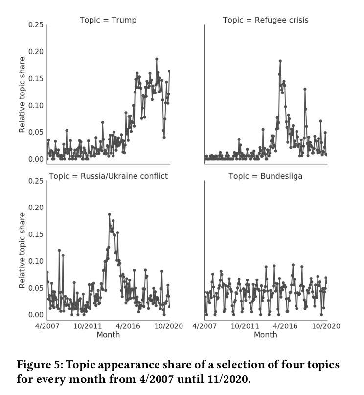
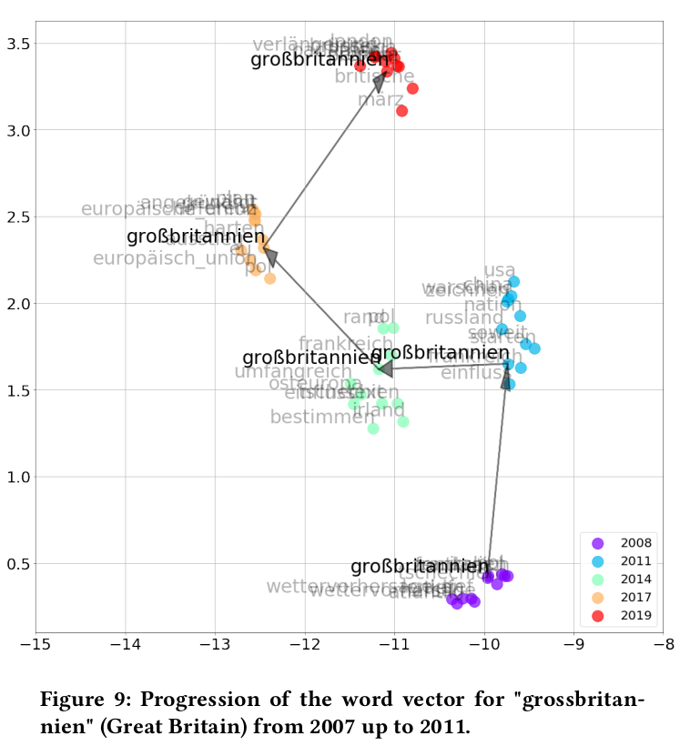

# Topic modelling for the Tagesschau

Applying LDA topic modelling and word embeddings to analyze topics covered in the German news broadcast "Die Tagesschau" and applying word embeddings to take a closer look at the change in reporting of specific subjects. Part of the Forschungspraktikum at CSSH (WS 2020/21).

## Contents
### Code
* **get_video.py** - Code used for extracting the episodes in .mp4 format from the Tagesschau archive at: https://www.tagesschau.de/multimedia/video/videoarchiv2.html
* **speech2text.py** - Code used to transcribe episodes using Google SpeechRecognition (VOSK (https://alphacephei.com/vosk/) as an alternative), creating a transcription data set.
* **topicModeling.py** - Code used to train LDA topic model for transcribed episodes.
* **word_embedding.py** - Code used to create (aligned) word embeddings of the Tagesschau transcriptions for different years/periods.
* **helper.py** - Additional helper functions e.g. functions to calculate word error rate.

### Notebooks
* **plot_overtime.ipynb** - Plotting the appearance of the topics from our LDA models over years/months.
* **topicModeling.ipynb** - Example of how to create topic models and find out the model with the best coherence score.
* **word_embeddings.ipynb** - Example of how to train word2vec models on our transcriptions, align them and create t-SNE plots for visualization of term change over years.
* **word_embedding_sanity_check.ipynb** - Quick sanity check of our word embedding approach compared to another more general German language word2vec model (https://devmount.github.io/GermanWordEmbeddings/).

### Saved dataframes
* **complete_df.csv** - Data set containing the original transcription with date plus metadata in form of subtitles and "Themen der Sendung"
* **preprocessed_df.csv** - Data set containing the transcriptions with out preprocessing pipeline (see topicModeling.py) applied to.
* **about_preprocessed.csv** - Preprocessed "Themen der Sendung" for word embedding sanity check.
* **about_preprocessed_notlower.csv** - Preprocessed "Themen der Sendung" without converting to lowercase for word embedding sanity check.

### Transcriptions
* **transripts/** - Transcriptions of Tagesschau episodes.
* **transcriptions_vosk/** - Small selection of transcriptions done with VOSK (https://alphacephei.com/vosk/) for calculating WER.
* **transcriptions_wer/** - Random election of hand-transcribed episodes for WER calculation.

## Selection of results

